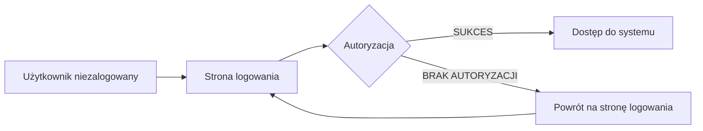
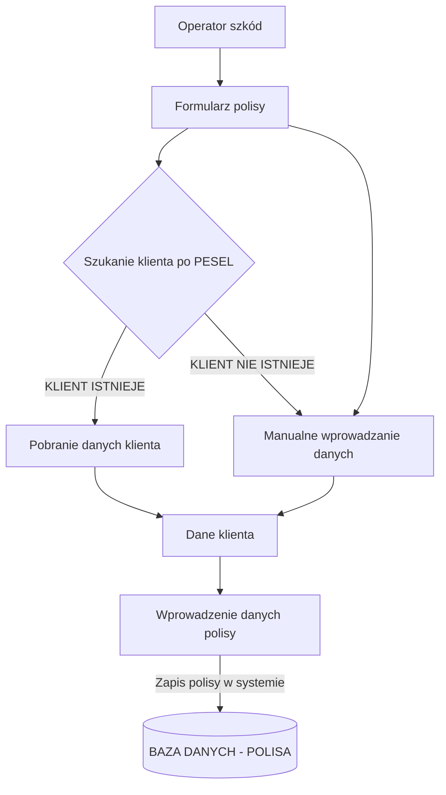
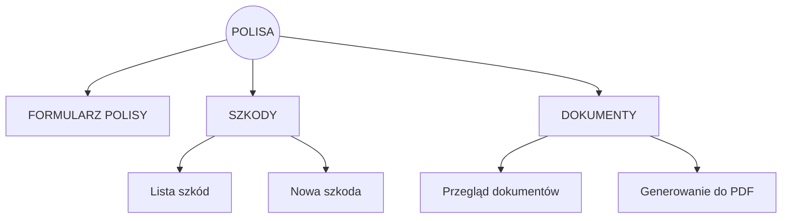
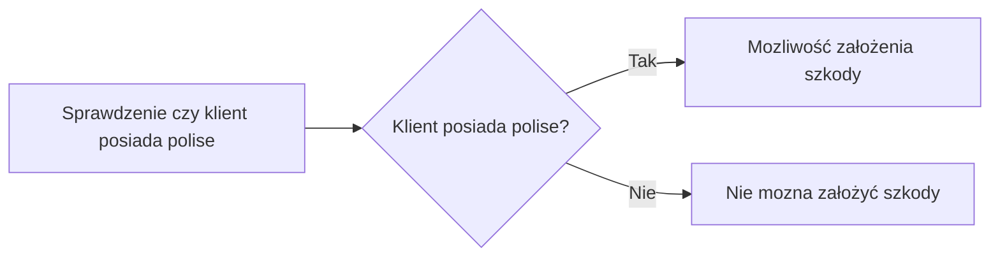
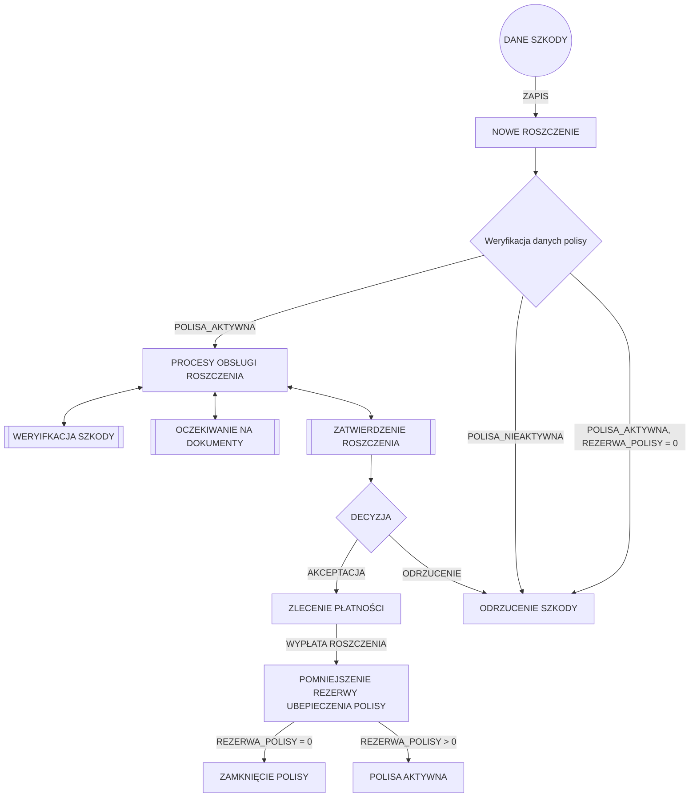

#  System Zawierania Umów Ubezpieczeniowych
## O projekcie:
|  |BEZPIECZNA PRZYSZŁOŚĆ | 2024 | Projekt stanowi przykład wykorzystania i integracji różnych technologii, pokazując umiejętność tworzenia kompleksowej aplikacji bazodanowej |
|--|--|--|--|

Aplikacja jest kompleksowym **systemem do zarządzania polisami i szkodami ubezpieczeniowymi**. 
Dzięki modularnej architekturze i zastosowaniu wzorców projektowych, aplikacja jest skalowalna, bezpieczna i łatwa w utrzymaniu.  
Dostęp do aplikacji jest zabezpieczony przy użyciu **Spring Security** i wymaga zalogowania. Użytkownicy systemu posiadają **określone role i uprawnienia** - dostęp może być uzależniony od roli.  
Zadaniem użytkownika systemu jest wprowadzanie danych klienta i zawieranie polis ubezpieczeniowych w zależności od wybranego przez klienta produktu ubezpieczeniowego.  
W przypadku gdy klient zgłosi szkodę, użytkownik wprowadza informacje o zdarzeniu do systemu a następnie operator szkód podejmuje decyzję odnośnie odrzuceniu lub akceptacji szkody i wypłacie odszkodowania.  
Dzięki wykorzystaniu obsługi zdarzeń procesy jakie musi wykonać operator szkód zostały zautomaytyzowane tak by ograniczyć jego pracę  
Produkty ubezpieczeniowe są definiowane tylko przez administratora systemu. (rola ADMIN).

## 💻 Wykorzystane technologie:

      
      

## Podgląd aplikacji (dane testowe generowane losowo)

## Założenia projektowe

Autoryzacja systemowa:

Zapis polisy:

Polisa utworzona - widok strony: 

Zgłaszanie nowego roszczenia:

Roszczenie w systemie:

## Funkcjonalności

 - **Podsumowanie polis i szkód w systemie**, w tym szkody zamknięte, wypłacone oraz dzisiejsze zgłoszenia.  
W aplikacji wykorzystane są specjalne wizualne znaczniki, np. szkód zawartych w danym dniu. SZKODY  3️⃣
- **Asynchroniczne pobieranie danych  klienta**  na podstawie PESEL do formularza, bez konieczności przeładowania.  
- **Asynchroniczne pobieranie ryzyk**  na podstawie wybranego produktu ubezpieczeniowego na formularzu.  
API do zwrócenia danych (JSON) oraz JavaScript do dynamicznego wczytywania danych do formularza.

- **Walidacja wielowarstwowa  danych**  na poziomie modelu  **(backend)**, jak również po stronie klienta  **(frontend)**.

- **Obiekty transferu danych  DTO**  używane do przesyłania danych między warstwami aplikacji.

- Wykorzystanie  harmonogramów **Scheduler**  do weryfikacji polis co 24h oraz  **aktualizacji statusów**  (np. gdy polisa wygaśnie).

- Manualne  **uzupełnianie modelu klienta i zawieranie polis ubezpieczeniowych oraz szkód**.  
Głównym założeniem systemu jest  **minimalizacja ręcznych procesów**  i wprowadzania danych.  
**Część danych jest generowana automatycznie, aby ograniczyć ryzyko błędów ludzkich**, na przykład:  
•  **Generatory numerów polis i szkód**  tworzą unikalne numery na podstawie określonego wzorca, wykorzystując  **Atomic Integer**  do zapewnienia ich unikalności.  
•  **Status polisy**  jest automatycznie ustawiany  **podczas tworzenia i aktualizacji**, a jego stan jest modyfikowany przez  **EventListener  (obsługę zdarzeń)**  oraz  **Scheduler**.  
•  **Opis statusowy szkody**  jest automatycznie ustawiany  **podczas tworzenia i aktualizacji szkody**, a jego stan jest modyfikowany przez  **EventListener  (obsługę zdarzeń)**.

- **Z poziomu**  zapisanej  **polisy**  można przejść  **do szkód ubezpieczonego**  (wybór z listy szkód) lub utworzyć nową:  
Gdy tworzymy szkodę z poziomu formularza polisy, dane klienta i polisy są przenoszone automatycznie do formularza szkód (API + JS).

- **Dynamiczne generowanie dokumentów**  na podstawie danych z polisy oraz  **zapisywanie ich do formatu PDF**.  
- Proste tworzenie szablonów dokumentów, które są automatycznie zaczytywane do listy dokumentów.

- Utworzone  **polisy i szkody są agregowane do listy z paginacją**, z możliwością  **sortowania oraz filtrowania**  wyników.

- Utworzenie szkody możliwe tylko poprzez walidację, czy polisa ubezpieczeniowa istnieje w systemie.  
Na podstawie wprowadzonego numeru polisy i odpowiedzi z API, jeśli polisa istnieje, mapowane są dane polisy na pola w formularzu szkody.

- Formularz szkodowy posiada czytelny baner etapu szkody, ułatwiający rozeznanie na szkodzie oraz opisowy status szkody (+ walidacja).  
[WERYFIKACJA POLISY ➡️ REJESTRACJA ROSZCZENIA ➡️ PODJĘCIE DECYZJI ➡️ WYPŁATA ODSZKODOWANIA]

- Weryfikacja szkód, zbieranie informacji o szkodzie i podejmowanie decyzji o wypłacie roszczeń.  
Wypłata roszczenia wpływa na stan rezerwy polisy i jej status.

